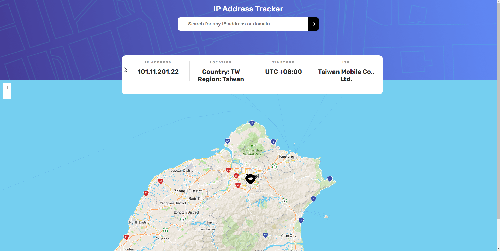

# IP-Address-Tracker

This is a solution to the [IP address tracker challenge on Frontend Mentor](https://www.frontendmentor.io/challenges/ip-address-tracker-I8-0yYAH0). 
## Table of contents

- [Overview](#overview)
  - [The challenge](#the-challenge)
  - [Screenshot](#screenshot)
  - [Links](#links)
- [My process](#my-process)
  - [Built with](#built-with)
  - [Useful resources](#useful-resources)

## Overview

### The challenge

Users should be able to:

- View the optimal layout for each page depending on their device's screen size
- Search for any IP addresses and see the key information and location of the found geo point on the map

### Screenshot

### Links

- Solution URL: [Add solution URL here](https://your-solution-url.com)
- Live Site URL: [Add live site URL here](https://your-live-site-url.com)

## My process

### Built with

- CSS file uploaded from [Frontend Mentor](https://www.frontendmentor.io/challenges/ip-address-tracker-I8-0yYAH0)
- Fonts uploaded from (https://fonts.googleapis.com)
- [IPify](https://geo.ipify.org/) - IP Geolocation API
- LeafletJS - For generating the map

### Useful resources

- [leafletJS examples](https://github.com/tomik23/leaflet-examples) - This helped me to use API of the leafletJS library. 
